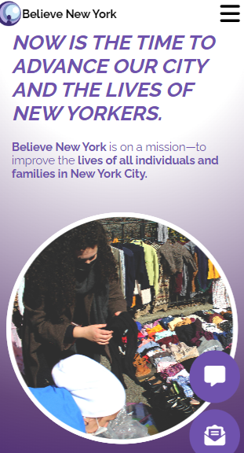
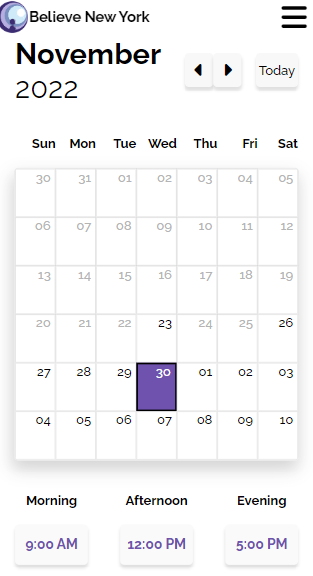
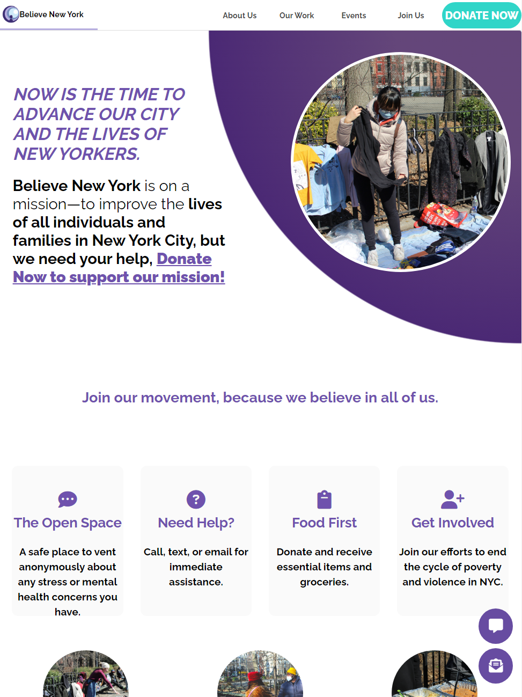

# BelieveNY

A web application for the non-profit organization, Believe New York. Following the MERN stack architecture, the Believe New York website employs the React.js JavaScript library to build a responsive user interface with reusable components that update and render in response to client-side changes. The React.js frontend is served to clients using the Express.js library that defines routes and handles HTTP requests in addition to interacting with the MongoDB database that stores session bookings for clients to schedule meetings. The Node.js runtime executes server-side code and manages middleware packages that extend Believe New York's website using RESTful APIs to generate business emails and engage with third-party payment processors.

The Believe New York front-end is built with Javascript XML syntax and styled with CSS without the usage of additional 3rd party frameworks.

[Believeny.org](https://www.believeny.org/)
 

